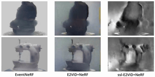

# [EventNeRF](https://4dqv.mpi-inf.mpg.de/EventNeRF/)
[Viktor Rudnev](https://twitter.com/realr00tman), [Mohamed Elgharib](https://people.mpi-inf.mpg.de/~elgharib/), [Christian Theobalt](https://www.mpi-inf.mpg.de/~theobalt/), [Vladislav Golyanik](https://people.mpi-inf.mpg.de/~golyanik/)



Based on [NeRF-OSR codebase](https://github.com/r00tman/NeRF-OSR), which is based on [NeRF++ codebase](https://github.com/Kai-46/nerfplusplus) and inherits the same training data preprocessing and format.

## Data

Download the datasets from [here](https://nextcloud.mpi-klsb.mpg.de/index.php/s/xDqwRHiWKeSRyes).

Untar the downloaded archive into `data/` sub-folder in the code directory.

See NeRF++ sections on [data](https://github.com/Kai-46/nerfplusplus#data) and [COLMAP](https://github.com/Kai-46/nerfplusplus#generate-camera-parameters-intrinsics-and-poses-with-colmap-sfm) on how to create adapt a new dataset for training. 

Please contact us if you need to adapt your own event stream as it might need updates to the code.

## Create environment

```
conda env create --file environment.yml
conda activate eventnerf
```

## Training and Testing

Use the scripts from `scripts/` subfolder for training and testing.
Please replace `<absolute-path-to-code>` and `<path-to-conda-env>` in the `.sh` scripts and the corresponding `.txt` config file
To do so automatically for all of the files, you can use `sed`:
```
sed 's/<absolute-path-to-code>/\/your\/path/' configs/**/*.txt scripts/*.sh
sed 's/<path-to-conda-env>/\/your\/path/' scripts/*.sh
```

## Models

 - `configs/nerf/*`, `configs/lego1/*` -- synthetic data,
 - `configs/nextgen/*`, `configs/nextnextgen/*` -- real data (from the revised paper),
 - `configs/ablation/*` -- ablation studies,
 - `configs/altbase.txt` -- constant window length baseline,
 - `configs/angle/*` -- camera angle error robustness ablation,
 - `configs/noise/*` -- noise events robustness ablation,
 - `configs/deff/*` -- data efficiency ablation (varying amount of data by varying the simulated event threshold),
 - `configs/e2vid/*` -- synthetic data e2vid baseline,
 - `configs/real/*` -- real data (from the old version of the paper)

## Mesh Extraction

To extract the mesh from a trained model, run

```
ddp_mesh_nerf.py --config nerf/chair.txt
```

Replace `nerf/chair.txt` with the path to your trained model config.


## Evaluation
Please find the guide on evaluation, color-correction, and computing the metrics in [`metric/README.md`](https://github.com/r00tman/EventNeRF/blob/main/metric/README.md).

## Citation

Please cite our work if you use the code.

```
@InProceedings{rudnev2023eventnerf,
      title={EventNeRF: Neural Radiance Fields from a Single Colour Event Camera},
      author={Viktor Rudnev and Mohamed Elgharib and Christian Theobalt and Vladislav Golyanik},
      booktitle={Computer Vision and Pattern Recognition (CVPR)},
      year={2023}
}
```

## License

This work is licensed under the Creative Commons Attribution-NonCommercial-ShareAlike 4.0 International License. To view a copy of this license, visit [http://creativecommons.org/licenses/by-nc-sa/4.0/](http://creativecommons.org/licenses/by-nc-sa/4.0/) or send a letter to Creative Commons, PO Box 1866, Mountain View, CA 94042, USA.

